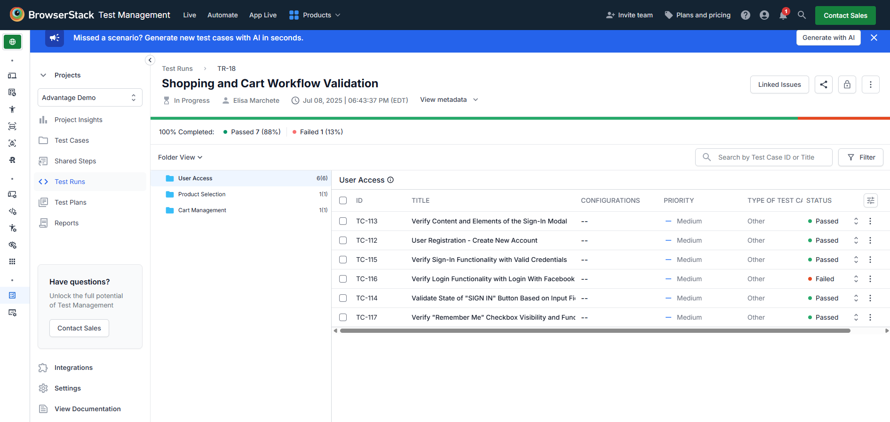
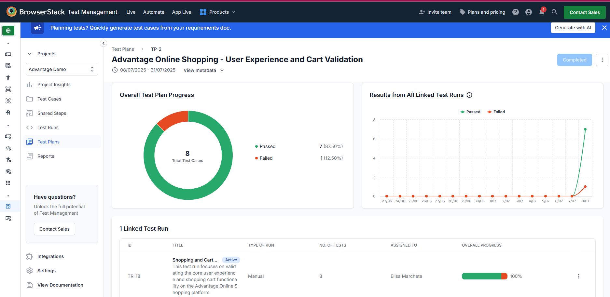
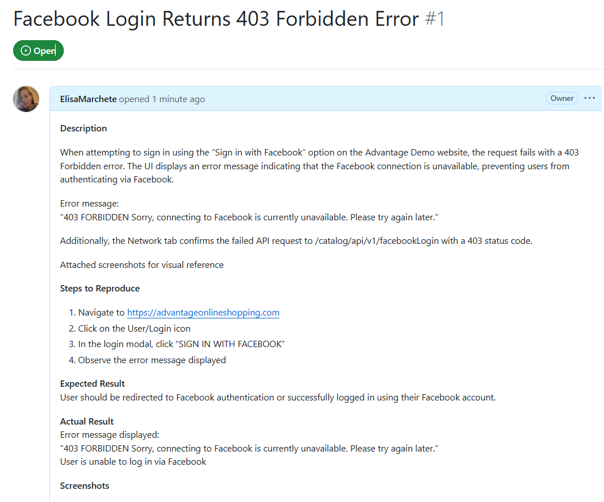
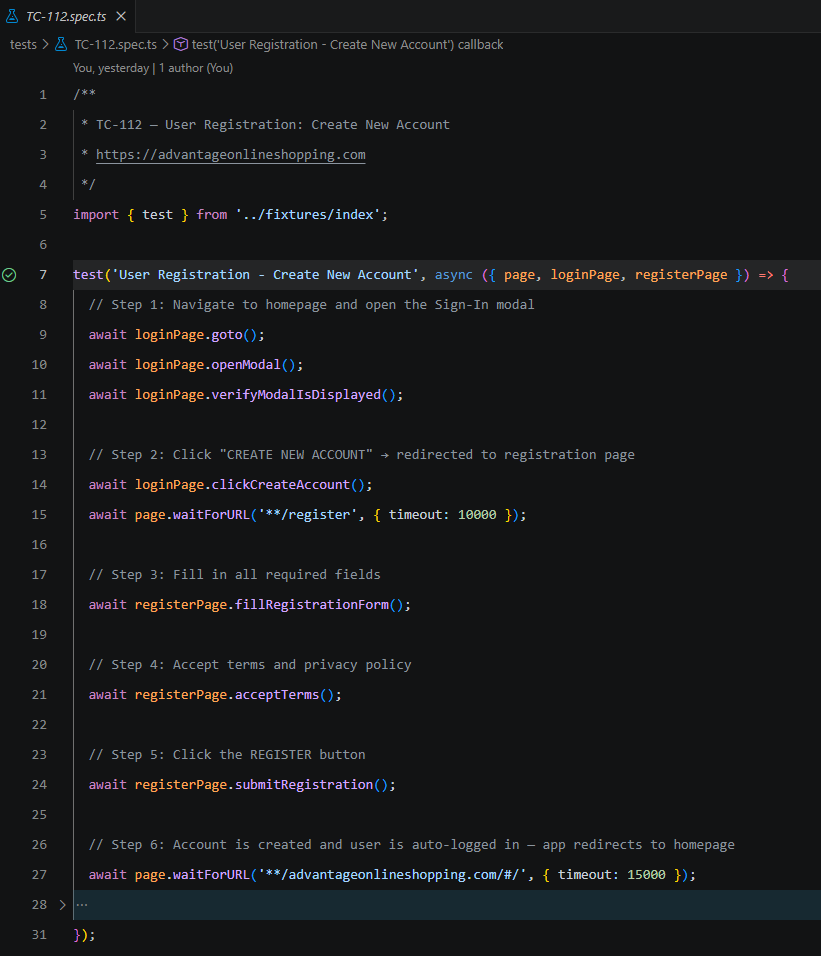

# Non-Official Advantage Demo Testing Repository

This repository showcases my **QA software testing skills** through **manual and automated testing** of Advantage Online Shopping's functionality. It includes:

✅ **Manual Testing on BrowserStack** – A test plan is created with clear test cases, and the test run is documented with the results.  
✅ **Bug Reporting in GitHub Issues** – Bug logged for failed test, including issue description, reproduction steps, the expected outcome, details about the testing environment and application version, and screenshot for visual reference.  
✅ **Automated Testing with Playwright** – Automated scripts using the Page Object Model (POM) to validate the search functionality.

## 📂 Repository Structure

### 1️⃣ Manual Testing on BrowserStack

🔹 **Test Run** **👉 [Click to View Test Run](https://test-management.browserstack.com/projects/2086625/test-plans/42244?public_token=8988a4bf3f10b3562528ee89866108fec2bf28771dfe4399853bb481665e0bbb3c6c0ab702942a2294c482054165621ae52bc1239c26175745e3ff1382b60f73&public_token_id=16422)**




### 2️⃣ Bug Reports

📌 **Bug logged for failed test (TC-110)** **👉 [Click to View GitHub Issue](https://github.com/ElisaMarchete/Advantage-Online-Shopping/issues/1)**



### 3️⃣ Automated Testing with Playwright

💻 Playwright test scripts for automated functional and visual validation to ensure the application's search functionality works correctly and looks as expected.
The method page object model (POM) is implemented to enhance code maintainability and readability.



## 🎥 Portfolio Playwright Demo

## Test Status (as of April 2026)

The tests are passing in April 2026. Refer to the videos below for a visual reference.

> **Note:** Test results may vary if Advantage Online Shopping’s interface has been updated since this recording.

🎬 **Advantage Online Shopping | Playwright Automation Test Execution – April 2026**  
**👉 [Click to View Demo](https://www.loom.com/)**

## 🚀 Running Playwright Tests

### Prerequisites

Ensure you have **Node.js (LTS version)** installed. You can download it from [nodejs.org](https://nodejs.org/).

1️⃣ **Clone this repository and navigate to test folder:**

```bash
git clone https://github.com/ElisaMarchete/Advantage-Online-Shopping.git
```

2️⃣ **Install dependencies:**

```bash
npm install
```

```bash
npx playwright install
```

3️⃣ **Run Playwright tests:**

```bash
npx playwright test
```

4️⃣ **View the Report:**

```bash
npx playwright show-report
```

## 🎯 About This Project

This project is part of my QA portfolio, demonstrating my ability to perform end-to-end testing, report defects, and implement test automation.
